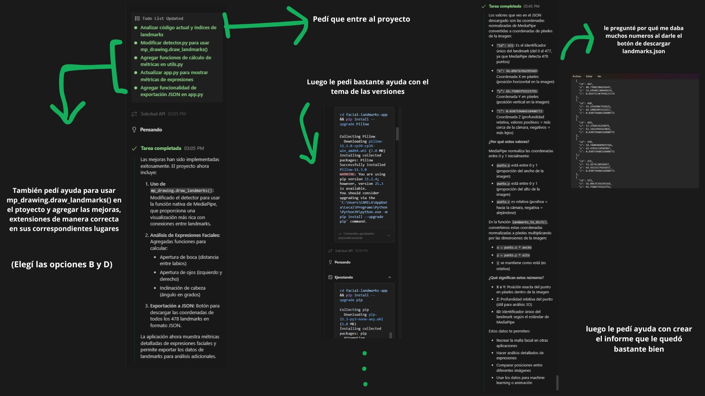

# Documentación Técnica - Detector de Landmarks Faciales

## Introducción

### ¿Qué son los Landmarks Faciales?

Los **landmarks faciales** son puntos de referencia anatómicos clave que mapean la estructura tridimensional de un rostro humano. Cada landmark representa una posición específica como esquinas de ojos, puntas de nariz, comisuras de labios, contorno de cejas, etc.

### Importancia de los Landmarks

Los landmarks faciales tienen aplicaciones críticas en múltiples campos:

- **Análisis de Expresiones**: Permiten cuantificar emociones mediante mediciones de distancias y ángulos
- **Filtros AR**: Base para superponer elementos virtuales en rostros reales
- **Autenticación Biométrica**: Verificación de identidad mediante comparación de geometría facial
- **Animación**: Creación de avatares realistas y captura de movimiento facial
- **Medicina**: Análisis de simetría facial y diagnóstico de condiciones médicas

## Arquitectura del Sistema

### Estructura del Proyecto

```
facial-landmarks-app/
├── app.py                 # Aplicación principal de Streamlit
├── requirements.txt       # Dependencias del proyecto
├── src/
│   ├── config.py         # Configuración de MediaPipe
│   ├── detector.py       # Clase detector de landmarks
│   └── utils.py          # Funciones auxiliares
├── README.md             # Documentación general
└── INFORME.md            # Documentación técnica (este archivo)
```

### Diagrama de Arquitectura

```
┌─────────────────┐    ┌─────────────────┐    ┌─────────────────┐
│   Streamlit UI  │───▶│   Detector      │───▶│   MediaPipe     │
│   (app.py)      │    │   (detector.py) │    │   Face Mesh     │
└─────────────────┘    └─────────────────┘    └─────────────────┘
         │                       │                       │
         ▼                       ▼                       ▼
┌─────────────────┐    ┌─────────────────┐    ┌─────────────────┐
│   Métricas      │    │   Utilidades    │    │   478 Landmarks │
│   Expresiones   │    │   (utils.py)    │    │   3D Coords     │
└─────────────────┘    └─────────────────┘    └─────────────────┘
```

### Flujo de Datos

1. **Entrada**: Usuario sube imagen JPG/PNG vía Streamlit
2. **Procesamiento**: Conversión PIL → OpenCV → RGB para MediaPipe
3. **Detección**: MediaPipe FaceMesh procesa imagen y retorna landmarks
4. **Análisis**: Cálculo de métricas de expresiones faciales
5. **Visualización**: Dibujo de landmarks usando `mp_drawing.draw_landmarks()`
6. **Exportación**: Conversión de landmarks a JSON para descarga

## Decisiones de Diseño

### Arquitectura Modular

**Decisión**: Separar la lógica en módulos especializados (`detector.py`, `utils.py`, `config.py`)

**Razones**:
- **Mantenibilidad**: Cada módulo tiene responsabilidad única
- **Reutilización**: Funciones pueden usarse en otros proyectos
- **Testabilidad**: Módulos independientes facilitan testing unitario
- **Escalabilidad**: Fácil agregar nuevas funcionalidades

### Uso de MediaPipe FaceMesh

**Decisión**: Implementar `mp_drawing.draw_landmarks()` en lugar de dibujo manual

**Razones**:
- **Rendimiento**: Aceleración por hardware optimizada
- **Conectividad**: Dibuja automáticamente conexiones entre landmarks
- **Consistencia**: Resultados visuales estandarizados
- **Actualización**: Beneficios de mejoras futuras de MediaPipe

### Análisis de Expresiones Simplificado

**Decisión**: Calcular métricas básicas (apertura boca/ojos, inclinación cabeza)

**Razones**:
- **Simplicidad**: Fácil de entender e implementar
- **Eficiencia**: Cálculos rápidos en tiempo real
- **Extensibilidad**: Base sólida para métricas más complejas
- **Educativo**: Demuestra conceptos fundamentales de análisis facial

### Exportación JSON Estructurada

**Decisión**: Formato JSON con coordenadas normalizadas convertidas a píxeles

**Razones**:
- **Interoperabilidad**: Compatible con múltiples plataformas
- **Legibilidad**: Fácil de parsear y visualizar
- **Completitud**: Incluye coordenadas X, Y, Z para análisis 3D
- **Estandarización**: IDs de landmarks siguen numeración MediaPipe

## Desafíos Técnicos y Soluciones

### Problema 1: Dependencias de OpenCV en Streamlit Cloud

**Desafío**: Error `ImportError` al importar `cv2` en entorno cloud

**Solución**: Cambiar `opencv-python` por `opencv-python-headless` en `requirements.txt`

**Aprendizaje**: Los entornos cloud requieren versiones sin dependencias gráficas

### Problema 2: Versiones Incompatibles de MediaPipe

**Desafío**: Versión `mediapipe==0.10.0` no existe en PyPI

**Solución**: Actualizar a `mediapipe==0.10.21` (primera versión disponible)

**Aprendizaje**: Verificar disponibilidad de versiones antes de especificar dependencias

### Problema 3: Renderización de Componentes en Streamlit

**Desafío**: Error `removeChild` en navegador durante actualización de componentes

**Solución**:
- Agregar `key` único a botón de descarga
- Cambiar `width=400` por `use_container_width=True` en imágenes

**Aprendizaje**: Streamlit requiere keys únicos para componentes dinámicos

### Problema 4: Coordenadas Normalizadas vs Absolutas

**Desafío**: MediaPipe retorna coordenadas 0-1, pero usuarios necesitan píxeles

**Solución**: Multiplicar coordenadas normalizadas por dimensiones de imagen

**Aprendizaje**: Entender el sistema de coordenadas de MediaPipe es crucial

## Conclusiones

### Aprendizajes Principales

1. **Arquitectura Modular**: La separación de responsabilidades facilita el desarrollo y mantenimiento

2. **Dependencias Cloud**: Los entornos de despliegue requieren consideraciones especiales (headless, versiones específicas)

3. **APIs de IA**: MediaPipe proporciona una base sólida pero requiere entendimiento de sus convenciones

4. **UI/UX en Streamlit**: Los componentes requieren keys únicos y configuración apropiada para estabilidad

5. **Procesamiento de Imágenes**: La conversión entre formatos (PIL ↔ OpenCV ↔ RGB) es fundamental

### Mejoras Futuras

- **Métricas Avanzadas**: Implementar análisis de emociones complejas usando machine learning
- **Procesamiento por Lotes**: Permitir análisis de múltiples imágenes simultáneamente
- **Visualización 3D**: Agregar vista tridimensional de la malla facial
- **Comparación Temporal**: Análisis de cambios en expresiones a lo largo del tiempo
- **Integración con APIs**: Conectar con servicios de IA para análisis más sofisticado

### Impacto Educativo

Este proyecto demuestra los fundamentos del procesamiento de imágenes y visión por computadora, sirviendo como base para estudiantes que desean incursionar en:

- Detección y análisis facial
- Desarrollo de aplicaciones web con IA
- Despliegue de modelos en la nube
- Arquitectura de software modular

El código resultante es limpio, documentado y extensible, proporcionando una base sólida para proyectos más avanzados en el campo de la visión por computadora.

## Galería de Imágenes

### USO de KILO

